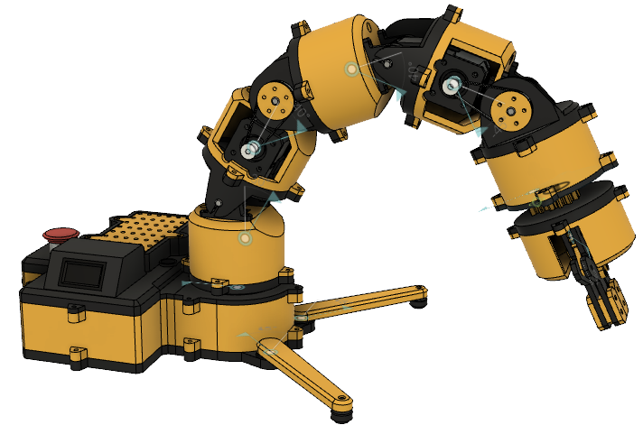
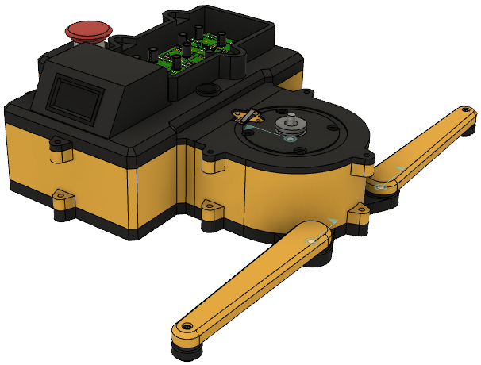
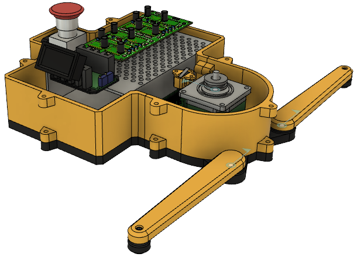

# Robotic-Arm

  

The robotic arm is a 6-DOF robotic arm. The base houses all the electronics to make it compact. The design is constructed so that it is 3D-printable and easy to assemble. It consists of 7-stepper motors, which are all connected to a PCB that houses all the electronics. 

  
   

